<!--
  HERO SECTION
  ASCII portrait + 3D ASCII wordmark
-->

<h3><code>Amankumarranjan8969@github ~ $ whoami</code></h3>

<table>
<tr>
<td valign="top">

</td>

<td valign="top">

</td>
</tr>
</table>

 
 

<!--
  ANIMATED CONTRIBUTION GRAPH
  Updated automatically by GitHub Actions
-->

<h3><code>Amankumarranjan8969@github ~ $ ./contributions.sh</code></h3>

 
 

<!--
  LINKS / PROFILE INFO
-->

<h3><code>Amankumarranjan8969@github ~ $ ./links.sh</code></h3>

<b>· AI Builder · RAG · LLM · Machine Learning · Data Science</b>

 

